# 엄마의지도

## 1. 기술 스택

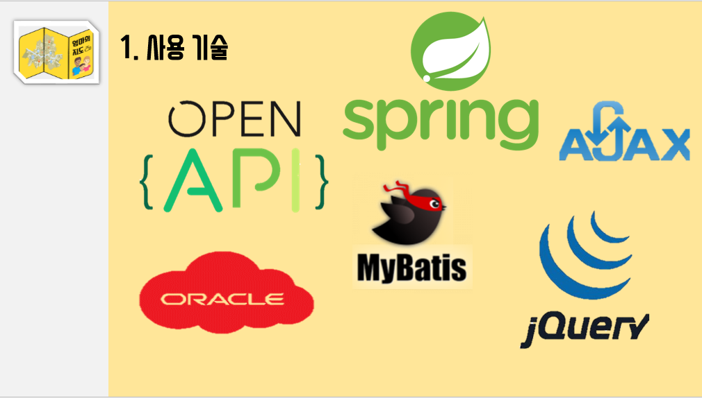

- Open API  
  - 유치원집 공공 API(<https://e-childschoolinfo.moe.go.kr/openApi/openApiIntro.do>)
  - 카카오 맵 API (<http://apis.map.kakao.com/>)	

- SpringMVC : 전체적인 틀로 사용 
- AJAX : 체크리스트의 체크박스 결과를 동적으로 바로 바로 보여주기 위해서 사용
- ORACLE : Open API의 데이터들을 DB에 저장하기 위해서 사용.
- Mybatis : java와 DB를 연동하기 위해서 사용
- JQurey : 유치원 상세페이지를 만들기 위해서 사용
  
  

## 2. 데이터베이스 

- DB 모델링

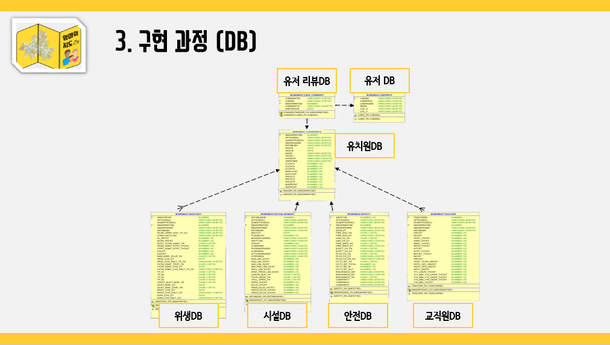

: 전체적인 DB 흐름은 가운데에 있는 유치원 DB를 중심으로, 유치원DB의 PK를 상속받는 위생, 시설, 안전, 교직원 등의 DB 들이 존재한다.

그리고 지도와 함께 유저 리뷰 서비스를 만들기 위해서 유저 리뷰DB와 유저 DB를 생성하였다.

- API -> DB 로 데이터 옮기는 과정

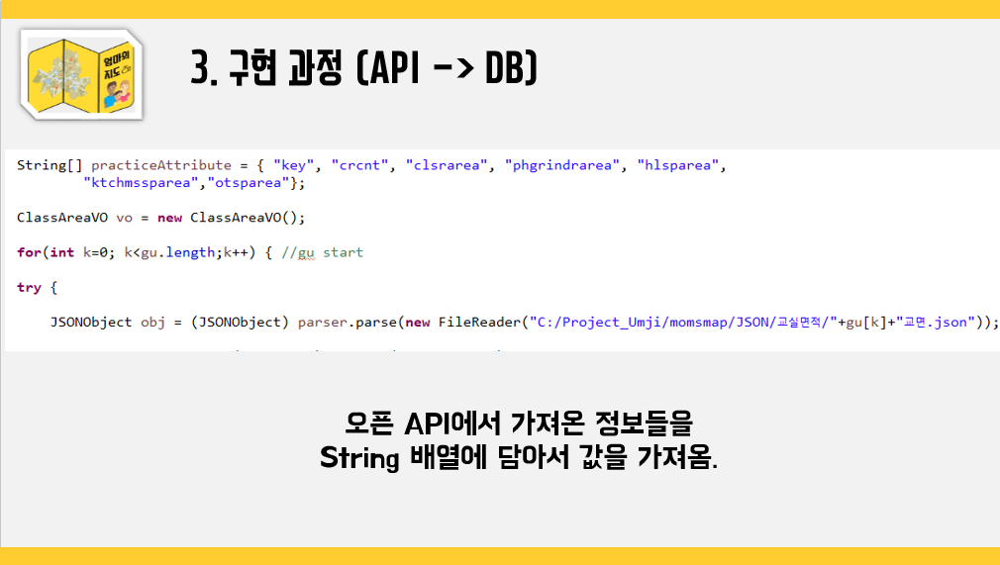

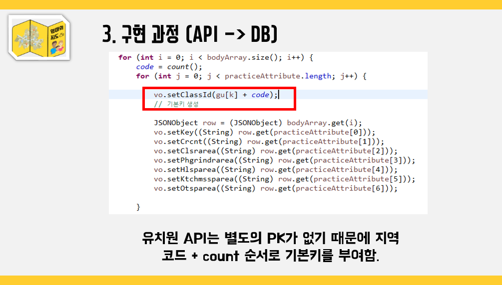

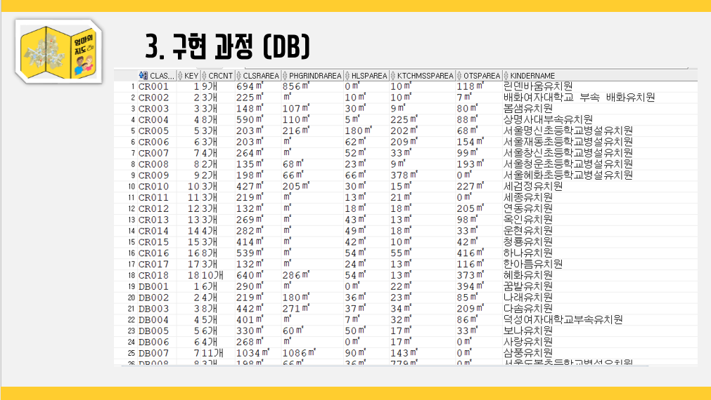

Open API에서 Json 파일(11개 * 25개구)들을 DB에 옮기는 과정,

11개의 api는 컬럼들이 다르기 때문에 넣어줄 때 마다 별도의 코드를 생성하고, 25개구의 숫자는 고정이기 때문에 한번에 25개 구의 데이터를 넣어주는 코드를 만들어서 데이터 전처리를 하였다.

## 3. 시연화면

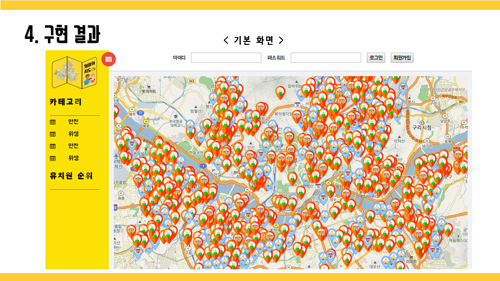

- 기본 화면, 유치원 설립 유형에 따라 마크를 4가지로 구분하였다. 
  - 빨간색은 사립(사인,법인) / 파란색은 공립(단설,병설)

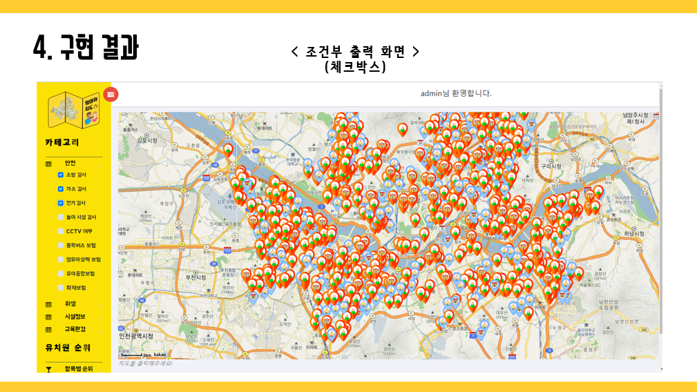

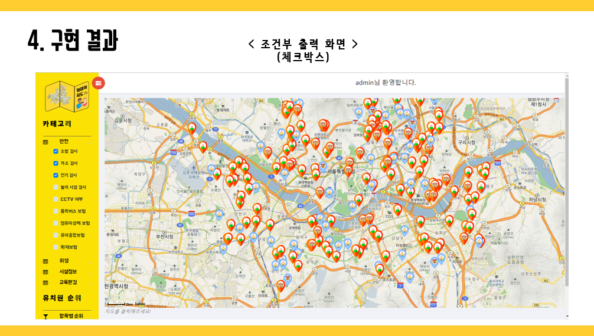

체크리스트를 열어서 해당 검사를 받았는지에 대해(최근 1년 이내에 안전 검사를 실시한 유치원) 조건을 걸어 필터링을 한 결과

Ajax를 사용하여 결과 값이 체크박스에 따라 실시간으로 바뀌게 하였다.

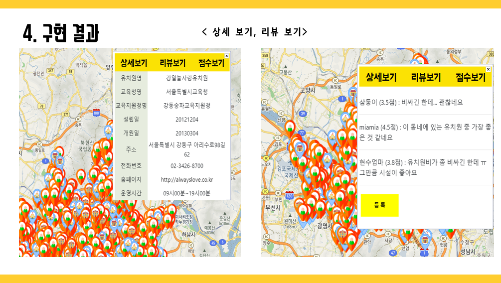

상세페이지 및 리뷰 페이지

동적 구성을 통해서 각 마크 하나 하나에 따라 별도의 정보 페이지와 리뷰 페이지가 나온다.

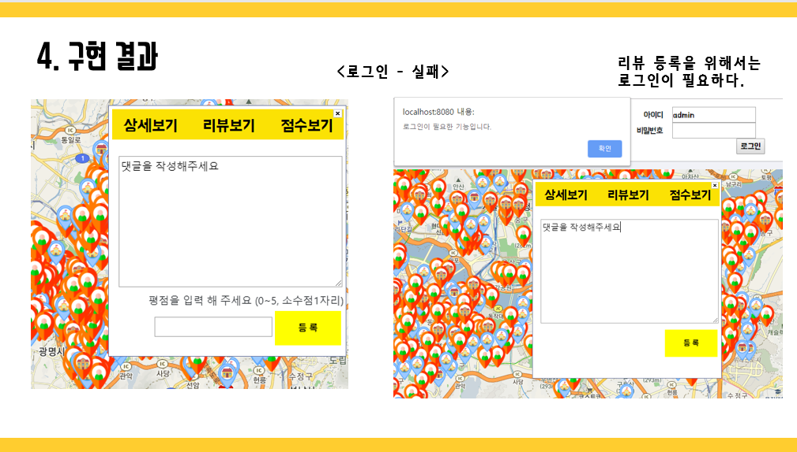

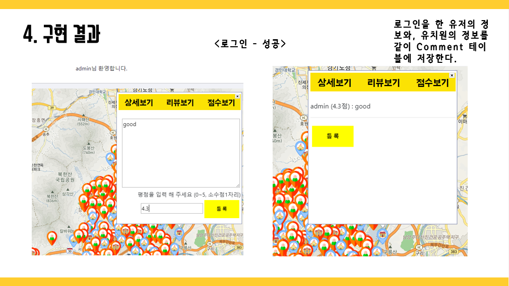

리뷰 기능의 경우 로그인을 해야만 입력이 되고, 리뷰를 입력할 시에 DB쪽 리뷰 데이터에 저장이 되어 해당 유치원의 리뷰 정보가 추가된다.

# 4. 개선사항

전체적으로 프로젝트 기간이 짧았고, Ajax나 Spring 연동 등 수업에서 배웠던 기술들을 실제로 적용하는데 까지 시간이 많이 걸려서 원래 계획의 80%? 정도만 완성 하였다.

원래는 

1. 평점을 입력 받는 과정에서 별점을 추가하여 마우스 드래그를 통해 점수를 부여하는 식으로 만들고
2. 리뷰보기 옆의 점수보기 항목에서 각 유치원의 안전,위생,시설,교육 정보 등을 점수화 및 시각화(D3js)해서 보여줄 계획이었고
3. 지도 사이트와 별도로 순위사이트를 만들어서 해당 구의 유치원 순위를 점수보기에서 점수화한 안전,위생,시설,교육 등의 항목과 종합 순위를 함께 보여줄 계획이었다. 

# 5. 느낀점

비록 시간에 쫓겨 부랴부랴 만들긴 했지만 결과물을 보니 뿌듯했고, 웹을 배운지 3개월? 정도 만에 사이트를 이런 식으로 만들 수 있게 된 것에 의미를 두려 하고 있다.

수업시간에 간단히 실습하는 것과는 꽤 난이도가 다르다는 것도 깨달았고 제한된 API 데이터를 통해서 어떤 결과를 내야 할지, 또 어떤 식으로 데이터 전처리를 해야할지 등을 고민해 볼 수 있어서 좋았던 것 같다.